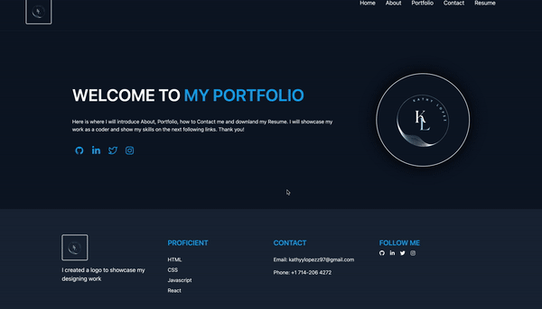

# Kathy React Portfolio

[](https://opensource.org/licenses/MIT)

  


## User Story
```
AS AN employer looking for candidates with experience building single-page applications
I WANT to view a potential employee's deployed React portfolio of work samples
SO THAT I can assess whether they're a good candidate for an open position

```
## Acceptance Criteria
```
GIVEN a single-page application portfolio for a web developer
WHEN I load the portfolio
THEN I am presented with a page containing a header, a section for content, and a footer
WHEN I view the header
THEN I am presented with the developer's name and navigation with titles corresponding to different sections of the portfolio
WHEN I view the navigation titles
THEN I am presented with the titles About Me, Portfolio, Contact, and Resume, and the title corresponding to the current section is highlighted
WHEN I click on a navigation title
THEN the browser URL changes and I am presented with the corresponding section below the navigation and that title is highlighted
WHEN I load the portfolio the first time
THEN the About Me title and section are selected by default
WHEN I am presented with the About Me section
THEN I see a recent photo or avatar of the developer and a short bio about them
WHEN I am presented with the Portfolio section
THEN I see titled images of six of the developer’s applications with links to both the deployed applications and the corresponding GitHub repositories
WHEN I am presented with the Contact section
THEN I see a contact form with fields for a name, an email address, and a message
WHEN I move my cursor out of one of the form fields without entering text
THEN I receive a notification that this field is required
WHEN I enter text into the email address field
THEN I receive a notification if I have entered an invalid email address
WHEN I am presented with the Resume section
THEN I see a link to a downloadable resume and a list of the developer’s proficiencies
WHEN I view the footer
THEN I am presented with text or icon links to the developer’s GitHub and LinkedIn profiles, and their profile on a third platform (Stack Overflow, Twitter)


```
## Table of Contents

- [Description](#description)
- [Links](#links)
- [Installation](#installation)
- [Usage](#usage)
- [License](#license)
- [Credits](#credits)
- [Contact me](#contact-me)


  
## Description
As a bootcamp student, I am close to the end of Coding bootcamp at the University of Minnesota. Here is where I implement what I learned in React. Also, create a portfolio using single page application, showcaseing Home, About, Portfolio, Contact and Resume about my work.

## Links
- [The URL of the deployed application](https://beautiful-parfait-f08b50.netlify.app/)
- [The URL of Github Repository](https://github.com/kathylopez97/Kathy-React-Portfolio)


## Installation 

Instructions on how 

1. Clone the repo

   ```
    git@github.com:kathylopez97/Kathy-React-Portfolio
    ````

   ```
   npm i 

   ```
   
   ```
   npm run dev
## Usage
 


## License 
[](https://opensource.org/licenses/MIT)

## Build with 
- 
- 
- 
- 
- 
## Credits 
- Youtube: [Youtube](https://youtube.com)
- Visual Studio Code: [VS Code](https://code.visualstudio.com/)
- Professional README Guide: [README.md](https://coding-boot-camp.github.io/full-stack/github/professional-readme-guide)
- Netflify [Deployment](https://vitejs.dev/guide/static-deploy.html#netlify)


## Contact me


Contact me If you have any questions or additional feedback.
- [Github](https://github.com/kathylopez97)
- [Email](kathyylopezz97@gmail.com)
